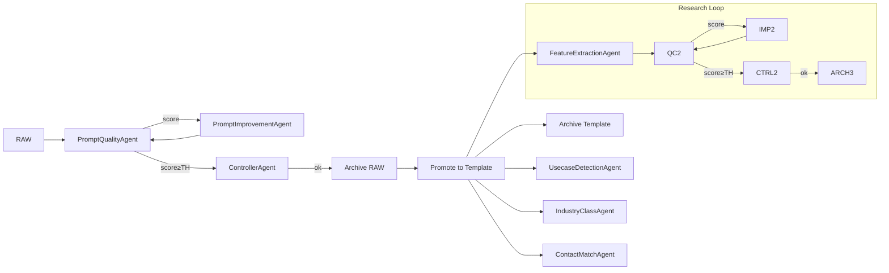

# PARTS2SALES A2A LLM HUB

## Overview

**PARTS2SALES A2A LLM HUB** is a modular, agent-based prompt lifecycle manager for industrial use cases. The focus is on **fully automated, versioned prompt quality assurance** across all stages: from RAW to PRODUCTION.

The system orchestrates autonomous LLM agents for evaluation, improvement, validation, and archiving of YAML prompts. It ensures traceability, high quality, and maintainability via structured logs, Pydantic schemas, and semantic versioning—**ready for business, AI teams, and CI/CD.**

## Core Features

- **Agentic Prompt Lifecycle:** Automated processing from RAW to PRODUCTION (incl. research loop, scoring, improvement, controller supervision).
- **Strict Versioning:** Complete support for semantic versioning, auto-increment, promotion, patch bump, and archiving.
- **Flexible Scoring:** Each quality check (raw, template, feature, usecase, industry, company, contact) uses its own scoring matrix (type-safe via Enum). Every criterion is validated via the LLM.
- **Pluggable Agents:** Clearly separated, easily extensible agent classes (Quality, Improvement, Controller, Extraction, Matchmaking, Reasoning, Ops).
- **Event Logging & Audit Trail:** Every action, score, or improvement is logged as an AgentEvent in JSON with timestamp and version.
- **Archiving:** Automatic archiving of prompts after every stage transition.
- **.env Config:** No secrets in code, all via OS environment variables.

## Agent Overview

| Agent                  | Purpose/Scope                                       |
| ---------------------- | --------------------------------------------------- |
| PromptQualityAgent     | Rates prompts (scoring, feedback, matrix-based)     |
| PromptImprovementAgent | Improves prompts according to feedback              |
| ControllerAgent        | Supervises, checks compliance, triggers loops/abort |
| FeatureExtractionAgent | Extracts technical features                         |
| CompanyMatchAgent      | Assigns companies to request/context                |
| ContactMatchAgent      | Matches and ranks contacts to companies             |
| CRM Sync Agent         | Synchronizes with HubSpot (or other CRM)            |
| UsecaseDetectionAgent  | Use-case detection, categorization                  |
| IndustryClassAgent     | Industry classification                             |
| CostMonitorAgent       | Monitors token & API costs                          |

## Lifecycle/Process Flow



**Process (simplified):**

1. CLI runner (`run_orchestration.py`) ingests a RAW prompt.
2. Quality check + scoring (via relevant matrix).
3. Loop: Improve/re-evaluate until threshold is met.
4. Controller releases, archives RAW, creates template.
5. Research loop: For each task (feature, usecase, etc.) its own agent/matrix/logic.
6. After each stage: Versioning, logging, archiving.

## Repository Structure

```plaintext
├── agents/
│   ├── prompt_quality_agent.py
│   ├── prompt_improvement_agent.py
│   ├── extract/feature_extraction_agent.py
│   ├── matchmaking/company_match_agent.py
│   ├── matchmaking/contact_match_agent.py
│   ├── matchmaking/crm_sync_agent.py
│   ├── reasoning/usecase_detection_agent.py
│   ├── reasoning/industry_class_agent.py
│   └── ops/cost_monitor_agent.py
├── controller/
│   └── agent_orchestrator.py
├── cli/
│   └── run_orchestration.py
├── config/
│   ├── max_retries.yaml
│   └── templates/quality_review_log_template.json
├── utils/
│   ├── jsonl_event_logger.py
│   ├── prompt_versioning.py
│   └── openai_client.py
├── prompts/
│   ├── 00-raw/
│   ├── 01-templates/
│   ├── 02-examples/
│   └── 99-archive/
├── docs/
├── logs/
└── tests/
```

## .env Template

```env
OPENAI_API_KEY=sk-...
MAX_ITERATIONS=3
HUBSPOT_API_KEY=your-key   # Optional, if CRM sync is enabled
LOG_LEVEL=INFO
```


## Getting Started

```bash
# Setup
python -m venv .venv
source .venv/bin/activate  # Windows: .venv\Scripts\activate
pip install -r requirements.txt  # installs python-dotenv

# Create .env and insert your keys

# RAW → TEMPLATE → RESEARCH → PRODUCTION
python cli/run_orchestration.py --all
# ...or for a single file:
python cli/run_orchestration.py --file prompts/00-raw/feature_determination.yaml
```

## Advanced

 - **LLM-based scoring:** The quality agent sends each criterion to OpenAI and interprets the reply as pass or fail for that criterion.
 - If the OpenAI API is unavailable, scoring fails and an error event is logged.
- **Archiving:** Prompts are moved after each status change to `prompts/99-archive/` (with timestamp, stage, version).
- **Test & CI:** All core functions have unit tests, integration tests for the agent pipeline (pytest-ready).
### Configuration

The number of improvement iterations is defined in `config/max_retries.yaml`.
`run_orchestration.py` reads this value to determine when to stop looping.


## Author

**Konstantin Milonas & AI Copilot**

## License

See [LICENSE](LICENSE).
Non-commercial, research, and internal use allowed. No resale without permission.

---

© 2025
