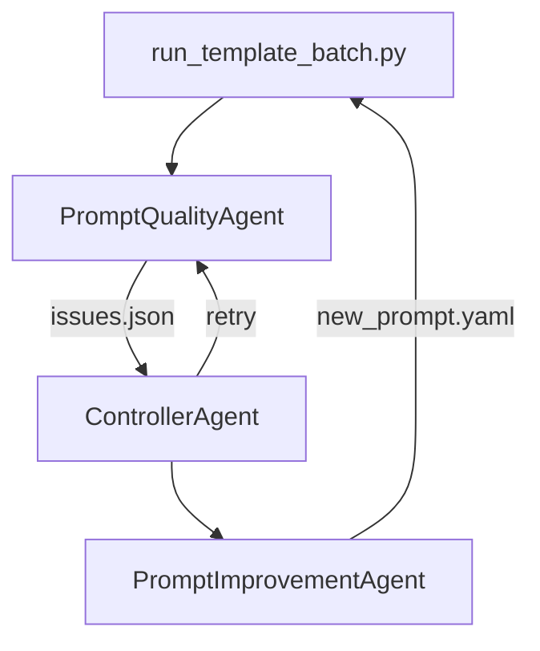

# 🧠 Prompt Agent Framework

Agentic Loop zur Bewertung, Verbesserung und Versionierung von LLM-Prompts.

## 🚀 Was ist das?

Dieses Projekt automatisiert die Qualitätskontrolle und Verbesserung von YAML-basierten Prompts für Large Language Models (LLMs). Es nutzt agentenbasierte Komponenten, um Prompts schrittweise zu analysieren, Feedback zu geben und zu verbessern, bis ein definierter Qualitätsstandard erreicht ist.

## 🧩 Architektur



### Komponenten

| Agent                            | Aufgabe                                                                   |
| -------------------------------- | ------------------------------------------------------------------------- |
| **PromptQualityAgent**     | Bewertet Prompt-Qualität über Metriken (z. B. task clarity, robustness) |
| **ControllerAgent**        | Prüft Feedback auf Vollständigkeit und semantische Korrektheit via GPT  |
| **PromptImprovementAgent** | Wendet Verbesserungen auf YAML-Prompt an und dokumentiert sie             |

## 🧪 Beispielausführung

### Einzeldatei verarbeiten

```bash
python run_template_batch.py --file prompts/templates/feature_determination_v1.yaml
```

### Mehrere Templates im Batch-Modus

```bash
python run_template_batch.py --all
```

## 📁 Verzeichnisstruktur

```
.
├── prompts/templates/                  # Eingabe-Prompts (YAML, *_v1.yaml)
├── logs/
│   ├── quality_log/                    # JSON: Dimension -> Issue
│   ├── feedback_log/                   # Verbesserungsfeedback
│   ├── change_log/                     # Prompt-Diffs mit Rationale
│   └── weighted_score/                 # Score-only Files
├── agents/
│   ├── prompt_quality_agent.py
│   ├── prompt_improvement_agent.py
├── controller_agent.py
├── run_template_batch.py
└── .env                                # OPENAI_API_KEY
```

## ⚙️ Konfiguration

- Alle Score-Definitionen unter `config/scoring/quality_scoring_matrix.json`
- `.env` benötigt:

```
OPENAI_API_KEY=sk-...
```

## ✅ Beispiel-Output

```json
{
  "task_clarity": "Minor or no issues detected in 'task_clarity'.",
  "output_spec": "The dimension 'output_spec' has room for improvement.",
  "robustness": "The dimension 'robustness' shows critical weaknesses and needs revision."
}
```

## 📌 Hinweis

- Du kannst den Controller-Agent so konfigurieren, dass er nach bestimmten Versionen abbricht oder neue Varianten erzeugt.
- Prompt-Qualität wird über gewichtete Scores berechnet und versioniert abgelegt.

## 📬 Kontakt

Konstantin | Data Analyst & Retail Consultant

---

Letzte Aktualisierung: 2025-05-31
